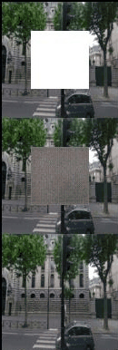
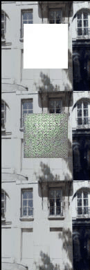

# Project : Context Encoders: Feature Learning by Inpainting
---
## Folder structure and instructions
The folder structure for the code is :
```
.
├── generator.py					# Generator Network
├── discriminator.py					# Discriminator network
├── run_test.bash					# Bash File (runs the test, Check contents for args to be passed
├── run_train.bash					# Bash File (runs the train, Check contents for args to be passed)
├── data_loader.py					# Image data loader
├── context_encoder.py					# Train Module
├── context_encoder_test.py				# Test module needs checkpoint as input
├── random_crop						# Train on random crops
│   ├── generator.py
│   ├── data_loader.py
│   ├── discriminator.py
│   ├── context_encoder.py
│   └── random_crop_epoch_results			# Results of random crops on train (around 4000 epochs)
├── paris_epoch_results_gifs				# Gifs from progress of epochs
│   └── split_images					# split-images obtained from image_spliter.py
├── paris_eval_results					# Obained results on eval data
├── paris_eval						# paris data eval set (get data from Pathak)
├── mid_eval_submissions				# submission folder for mid eval (project) 
│   └── images						# Random crop on CIFAR10
├── paris_train						# train images needs to be here (get data from Pathak)
├── log							# Logs
├── cat_dataset_results					# Results on Cat Dataset
├── final_eval_submission				# submission folder for final eval (project)
├── misc
│   ├── image_splitter.py				# batch image spliter
│   ├── gifmaker.py					# gif maker
│   └── run_help					# misc
├── run.md						# describes how to run the code
├── check_points					# checkpoint saved
├── README.md						# Readme
└── paris_epoch_results					# Epcoh wise one batch results
```
before cloning repo install `git lfs` as the repo includes `check_point.pt` which is over `800MB`

## Results over the paris dataset
The sample results of the dataset along with the ground truth and the cropped-out region. Top is the cropped image input to the generator and the middle is the output of the generator and last image shows the ground truth.
Some of the results obtained on Paris Dataset<br/>


<br/>
Gifs illustrating Epoch-wise improvements<br/>





## Graphs of the train and validation losses across the epochs


## Results over cat dataset
Some of the results obtained on Cat dataset<br/>


## Links
## Paris_dataset
#Note:
The Paris Building Dataset cannot be made publicly available. Access to dataset can be obtained via mailing the original paper authors: Deepak Pathak, Philipp Krahenbuhl, Jeff Donahue, Trevor Darrell & Alexei A. Efros.
## [Code for plots]
(https://colab.research.google.com/drive/1qHWsU9b6sVo0FfPebkF1GWZlLIpI-Cs0)<br/>
## [Presentation]
(https://docs.google.com/presentation/d/1QF8oylaEKNHnNxCboERB1qOtrI7GsiZj1sY1es17YgM/edit?usp=sharing)<br/>


# System Setup

## Modules 

python == 3.7<br/>
pytorch == 1.4<br/>
cudatoolkit == 10.1<br/>
pygifsicle<br/>

## System Config and time to train

CPU Ryzen 5 3600<br/>
GPU GTX 1080ti 11GB<br/>
RAM 16GB 3600MHz<br/>

Random Crops around 4100 epochs took 32 Hrs<br/>
Center Crops around 200 epochs took 2hr 30min<br/>

