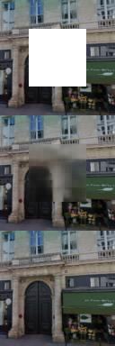
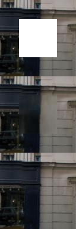
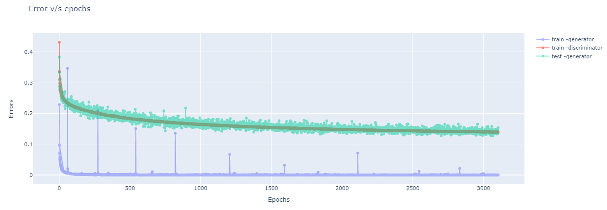

# Project Context-encoder
---
## Folder structure and instructions
The folder structure for the code is :

    .
    ├── images                          #epoch wise outputs when using dogs and cats dataset of image net
    ├── log                             #log files of outputs
    ├── paris_eval                      #set of validation files
    ├── paris_eval_results              #results of the validation files after training for 3000 epochs
    ├── results                         #epoch wise results for all images in paris_eval
    ├── misc                 
    │   ├── Screenshots                 #includes the screenshots of the model while running
    │   └──bash scripts                 #used for running the code
    ├── Context_encoder.ipynb           #code for running in google colab
    ├── context_encoder.py              #code for training and validating in gpu
    ├── data_loader.py                  #code for loading data into the model
    ├── discriminator.py                #model of dicriminator defined
    ├── generator.py                    #model for generator defined
    ├── test.py                         #code for testing the trained models.
    └── README.md

## Results over the paris dataset
The sample results of the dataset along with the ground truth and the cropped out region. Top is the cropped image input to the generator and the middle is the output of the generator and last image shows the ground truth.
Some of the best results are shown below

## Graphs of the train and validation losses across the epochs

